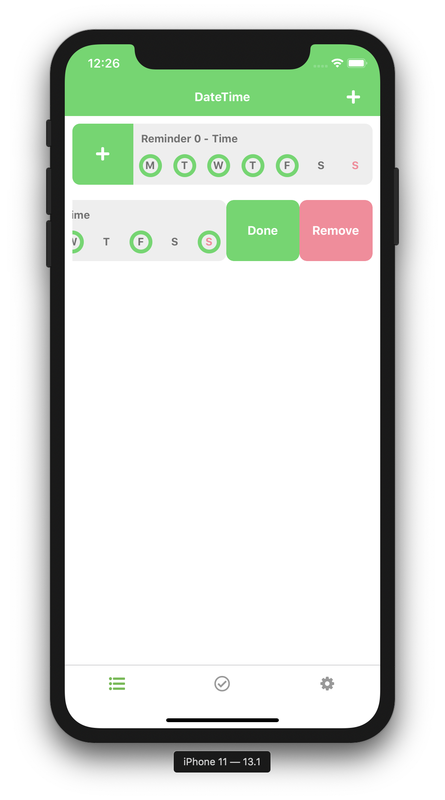

# projectDailyReminder_RN
A combined Reminder and Todo list to help with my daily productivity. 
### Checkout at Develop to test
The fuctionalities are: 
- Make Reminder based on:
  - Name. 
  - Time. 
  - Repeat by Day of Week. 
  - Icon and Colors.
- To do list 
  - Allow sub items.
  - Collapsible.
- ~~Dark Mode~~(Scrapped, iOS came with Darkmode)
## To do list: 
- [X] Make prototype (Learnt to do this the hard way)
- [X] ~~DarkMode animation and change color~~ (Scrapped, iOS came with Darkmode)
- [X] Reminder Item
- [X] Reminder List 
- [X] Reminder swipe to delete/complete
- [X] Add reminder modal
- [ ] To do Item
- [ ] To do List 
- [ ] To do toggle Done/Not done
- [ ] To do collapible 
- [ ] Add to do modal
- [ ] Save data to storage.
## Screenshots:
Reminder screen

